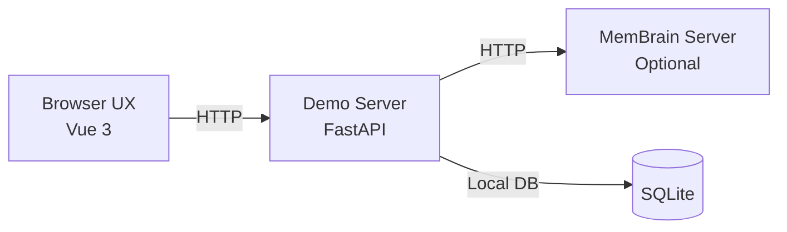

# 🧠 MemBrain Demo

A streaming role-playing chat demo powered by the MemBrain memory backend. The frontend is built as a **Vue 3 SPA**, the backend is powered by **FastAPI**, and it uses **SQLite** to store conversation history natively. It optionally integrates with the MemBrain backend for cross-session long-term memory.

---

## 🏗 Architecture Overview



> [!TIP]
> The Demo backend can run completely independently! If you are not connecting to the MemBrain service, simply leave the `MEMBRAIN_BASE_URL` environment variable empty.

---

## 🛠 Prerequisites

Ensure you have the following installed before proceeding:

| Tool | Version / Details | Description |
|:-----|:------------------|:------------|
| 📦 `uv` | Latest | Python package manager. [Installation Guide](https://docs.astral.sh/uv/getting-started/installation/) |
| 🟢 `node` / `npm` | `v18+` | Frontend build tools. |
| 🐍 Python | `v3.11+` | Automatically managed by `uv` (no separate installation required). |

---

## 🚀 Getting Started

### Step 1: Start MemBrain Backend (Optional)

> [!NOTE]
> If you do not need the long-term memory feature, **skip this step** and proceed directly to [Step 2](#step-2-configure-demo-environment-variables).

The MemBrain backend runs in the **repository root directory** and requires PostgreSQL, an Embedding service, and a Rerank service.

#### 1.1 Configure Environment Variables

```bash
# From the repository root directory
cp docs/env/demo.env.example .env
```

Edit the newly created `.env` file, focusing on these key configurations:

```dotenv
# LLM Service (shared with Demo)
LLM_API_URL=http://localhost:4000/v1
LLM_API_KEY=sk-1234

# PostgreSQL Database Settings
DB_HOST=localhost
DB_PORT=5432
DB_USER=postgres
DB_PASSWD=MemBrain
DB_NAME=MemBrain-Demo

# Backend Port (Demo's MEMBRAIN_BASE_URL must match this)
BACKEND_PORT=9574
BACKEND_MODE=demo       # Options: dev | evaluation | demo
BACKEND_WORKERS=4       # Valid only in demo mode

# Embedding Service (local vLLM default, or use external APIs like OpenAI)
EMBED_SERVICE_URL=http://localhost:9113/v1/embeddings
EMBED_MODEL=qwen3-embed
EMBED_DIM=2560

# Rerank Service (local vLLM default, or use external APIs like Cohere)
RERANK_SERVICE_URL=http://localhost:9114/v1/rerank
RERANK_MODEL=qwen3-rerank
```

#### 1.2 Install Dependencies & Start

```bash
# From the repository root directory
uv sync
uv run backend
```

Once started successfully, the backend will listen on `http://127.0.0.1:9574` (or whatever `BACKEND_PORT` you configured).

---

### Step 2: Configure Demo Environment Variables

Switch to your demo directory and set up the local variables:

```bash
cd demo
cp .env.example .env
```

Edit `demo/.env`, updating the following values as needed:

```dotenv
# LLM Service (used for role-play chat inference)
LLM_API_URL=http://localhost:4000/v1
LLM_API_KEY=sk-1234

# Demo Server's listening port
BACKEND_PORT=10413

# MemBrain backend address
MEMBRAIN_BASE_URL=http://127.0.0.1:9574

# 💡 Leave empty or comment out to disable long-term memory features entirely:
# MEMBRAIN_BASE_URL=
```

*(Remaining configurations like storage path or conversation window size can safely be left as defaults.)*

---

### Step 3: Start the Demo Service

```bash
cd demo
./start.sh
```

This bootstrap script will automatically:
1. Install frontend dependencies and build the static assets (`npm ci && npm run build`).
2. Sync and install Python dependencies (`uv sync`).
3. Start the FastAPI backend and serve the frontend statically.

🎉 **Done!** Visit [`http://localhost:10413`](http://localhost:10413) (or your configured `BACKEND_PORT`) in your browser to start chatting.

---

## 🧑‍💻 Development Mode

If you are modifying the Vue 3 frontend and need **hot-module reloading** (HMR), start the frontend and backend separately:

**1️⃣ Start the Backend** (Terminal 1)
```bash
cd demo
uv run python -m src.main
```

**2️⃣ Start the Frontend Dev Server** (Terminal 2)
```bash
cd demo/web-app
npm install
npm run dev
```

> [!WARNING]
> The frontend development server runs on `http://localhost:5173` by default. Ensure that the `CORS_ORIGINS` value in `demo/.env` includes this address to prevent cross-origin errors.

---

## ❓ FAQ

<details>
<summary><b>Can the Demo run normally without enabling the MemBrain backend?</b></summary>
<br>
Yes! If you leave <code>MEMBRAIN_BASE_URL</code> empty, all memory-related calls gracefully fall back to silent no-ops. Core chat and role-playing functions will continue to work perfectly.
</details>

<details>
<summary><b>How do I reset or clear conversation data?</b></summary>
<br>
You can easily wipe the demo datastore by deleting the <code>demo/data/membrain.db</code> file, or by running the cleanup script:

```bash
uv run python scripts/clean_db.py
```
</details>
